# BSPWM | Polybar themes collection with Theme Selector

Fork desde [gh0stzk](https://github.com/gh0stzk/dotfiles) & [ghost1nth3ssh](https://github.com/ghost1nth3ssh/dotfiles) dotfiles para sistemas basados en Debain.

## 🌿 Information
3 temas diferentes para BSPWM, Polybar y ZSH Powerlevel10k. Con un selector de temas para cambiar sobre la marcha.

## Info


|Distro|[Kali](https://www.kali.org/)| 
|:---:|:---:|
|WM|[BSPWM](https://github.com/baskerville/bspwm)|
|Bar|[Polybar](https://github.com/polybar/polybar)|
|Menu|[Rofi](https://github.com/davatorium/rofi)|
|Compositor|[Picom](https://archlinux.org/packages/community/x86_64/picom/)|
|Terminal|[Kitty](https://github.com/kovidgoyal/kitty)|
|Shell|[Zsh](https://archlinux.org/packages/extra/x86_64/zsh/) & [Powerlevel10k](https://github.com/romkatv/powerlevel10k/tree/master)|

<br>

## 🚀 Features


* **Cambia temas sobre la Marcha:** 3 Rices diferentes ahora!.

* **Selector de temas:** <code>alt + space bar</code> para ejecutarlo.

* **Wallpaper Aleatorio:**  Cada vez que cambias entre rices o recargas bspwm con <code>super + alt + r</code> se pone un nuevo fondo de pantalla dependiendo del rice en el que estés.

* **Wallpaper tool** <code>super + alt + w</code> cambia entre los diferentes fondos de pantalla en el rice real.

**And more..**

## 🎨 The themes

### 🦑Cthulhu:

|||
|---|---|

<details>
<summary><b>Wallpapers Extra en Cthulhu</b></summary>

|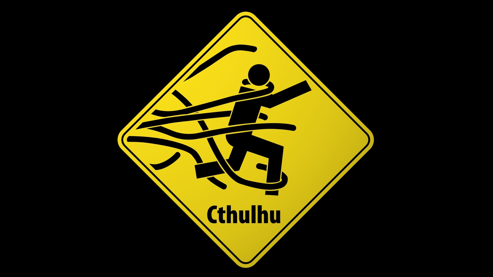||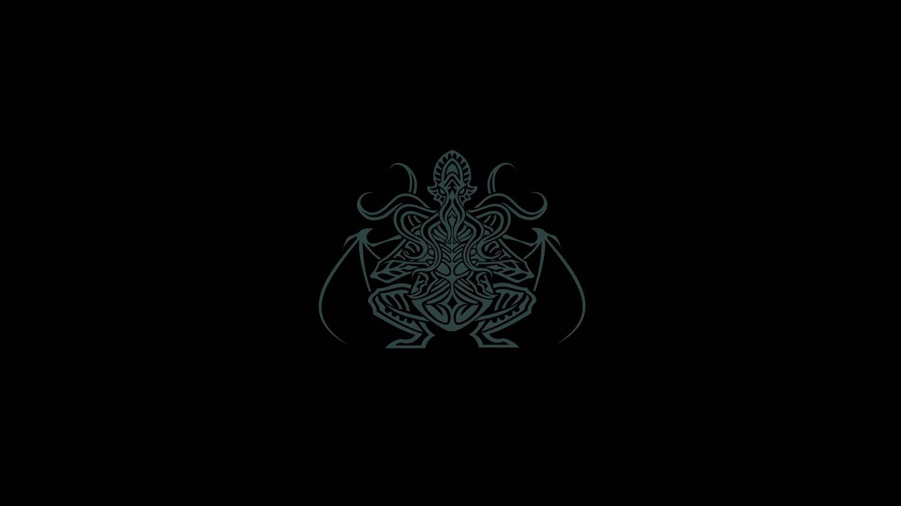|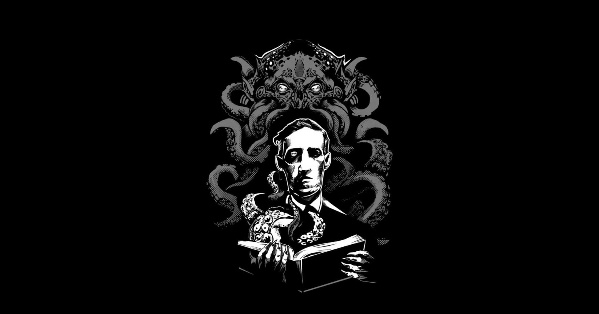|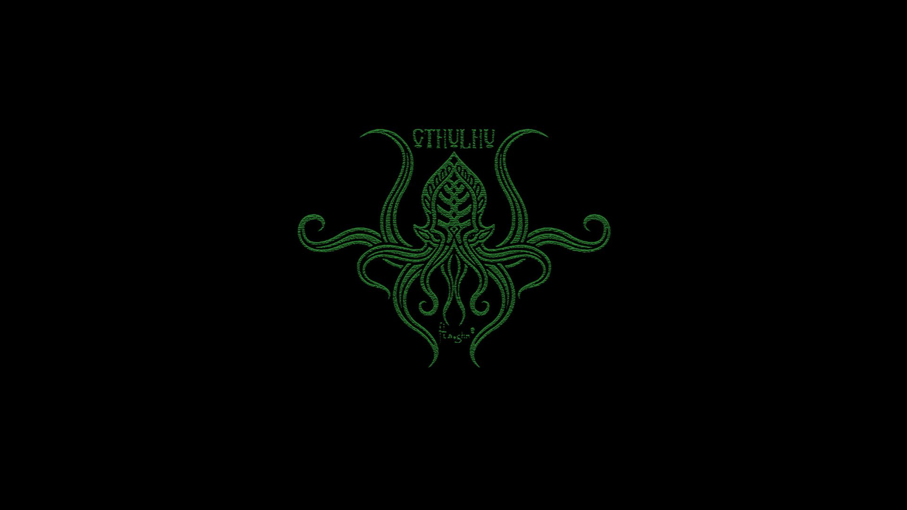|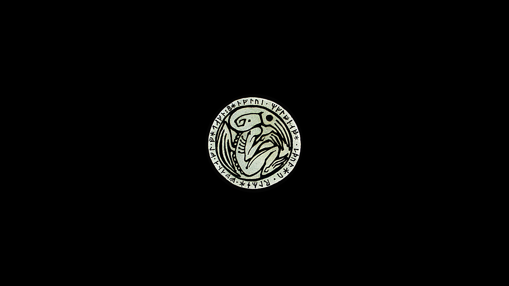|

</details>

### 👻Ghost

|||
|---|---|

<details>
<summary><b>Wallpapers Extra En Ghost</b></summary>

|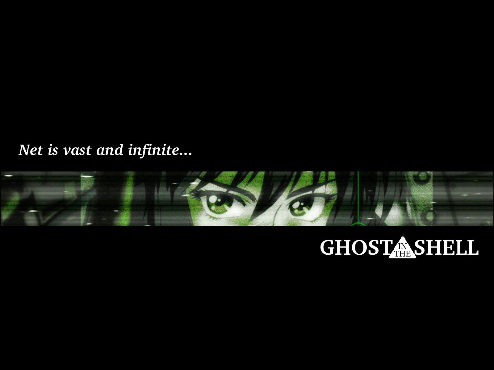|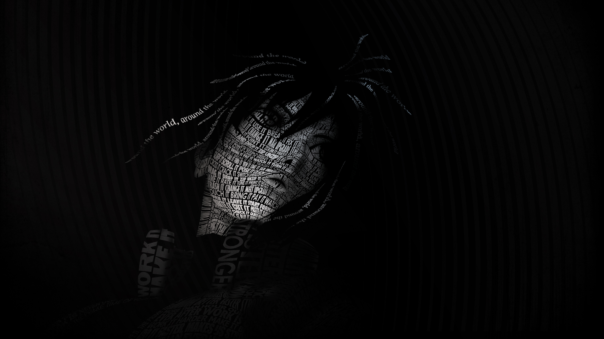|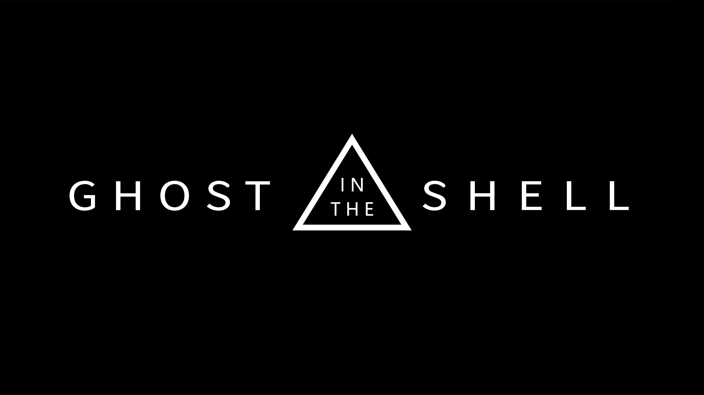|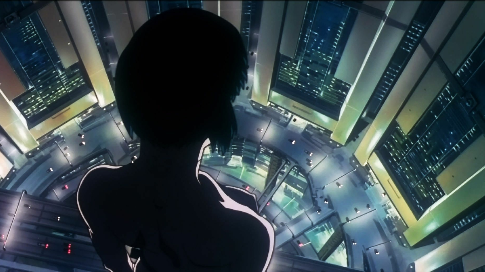|

</details>

### 👽Lain

|||
|---|---|

<details>
<summary><b>Wallpapers Extra en Lain</b></summary>

|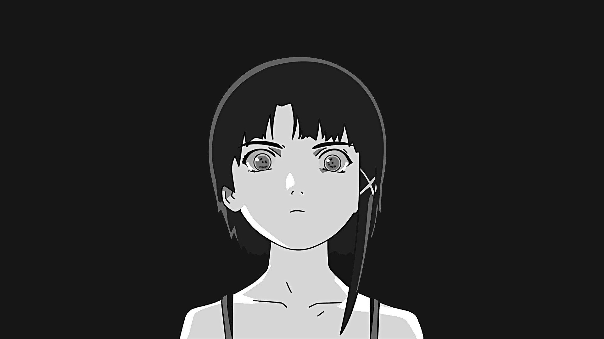|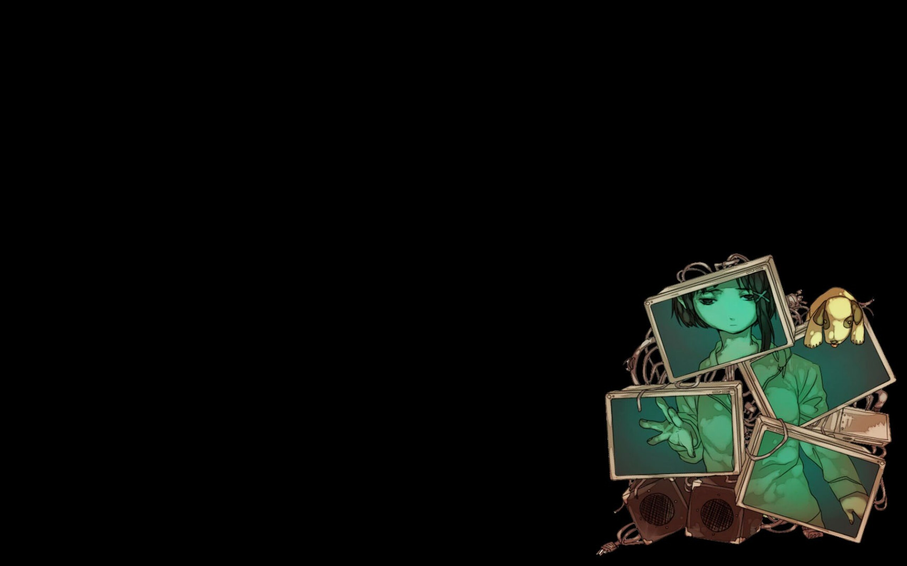|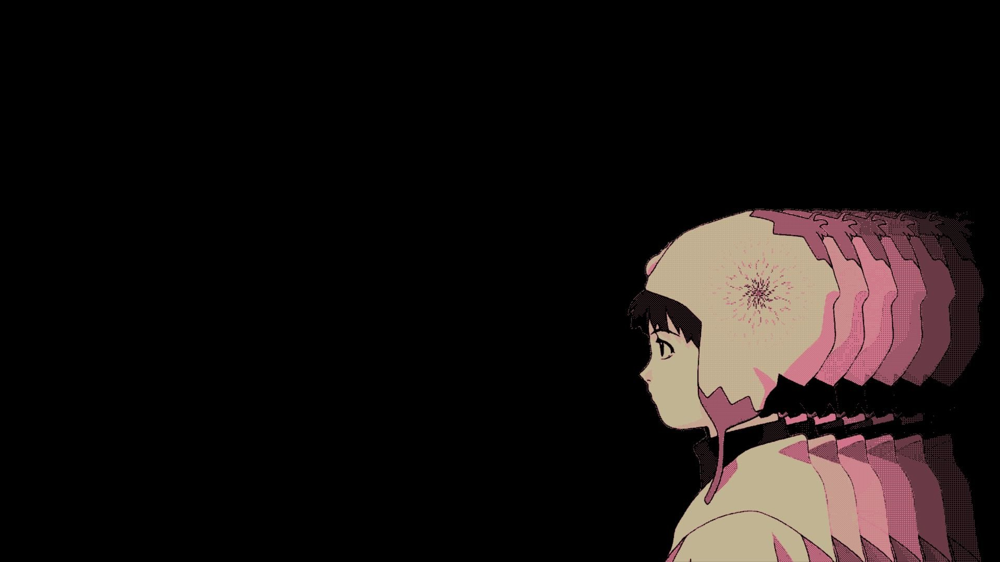||

</details>

## Keybindigs muy útiles de conocer...
- super + h                  Muestra la ayuda de atajos de teclado.
- alt + espacio              Muestra el menú para seleccionar el selector de temas.
- super + shift + v          Abre Visual Studio Code.
- super + shift + f          Abre Firefox.
- super + shift + b          Abre Burpsuite.
- ctrl + super + alt + p     Apaga el ordenador. 
- ctrl + super + alt + r     Reinicia el ordenador.
- super + Return             Abre un terminal.
- super + Alt + Return       Abre un terminal flotante.
- ctrl + super + alt + k     Mata bruscamente una ventana/proceso.
- super + alt + w            Cambia aleatoriamente el fondo de pantalla.
- super + alt + r            Reinicia bspwm.


Y mas.. Usted necesita ver el archivo sxhkdrc para más.

## 📦 setup

### 💾 Installation:
The installer only works for **Debian** Linux (I guess that Ubuntu could work as well).

<b>Open a terminal in HOME</b>
- **First download the installer**
```sh
git clone git@github.com:Ghost1nTh3SSH/dotfiles.git
```
- **Now give it execute permissions**
```sh
cd dotfiles
```
- **Finally run the installer**
```sh
./installer.sh
```